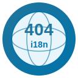

# 🌍 WP i18n-404-tools Logo

**Missing Internationalization Tools for WordPress**

## Logo Display

### On Light Background

  

### On Dark Background

  

## 📏 Various Sizes

| 128×128 | 64×64 | 32×32 | 16×16 |
|:-------:|:-----:|:-----:|:-----:|
|  |  |  |  |

## 🎨 Design Elements

- 🌍 **Globe with meridians/parallels** - Representing internationalization (i18n)
- ❌ **Bold "404" text** - Symbolizing missing tools (clever wordplay on HTTP 404 errors)
- 🔤 **"i18n" label** - Clear identification of the internationalization focus
- 🌐 **Language codes** - EN, ES, FR, DE, ZH, JA around the globe showing global support
- 🎨 **WordPress blue colors** - Official WordPress color scheme (#21759b, #0073aa)
- ✨ **Gradient backgrounds** - Modern, professional appearance
- 📐 **Scalable vector format** - Looks sharp at any size

## Icon

The project also includes a smaller icon version:

  

### Icon Sizes

| 128×128 | 64×64 | 32×32 | 16×16 |
|:-------:|:-----:|:-----:|:-----:|
|  |  |  |  |
